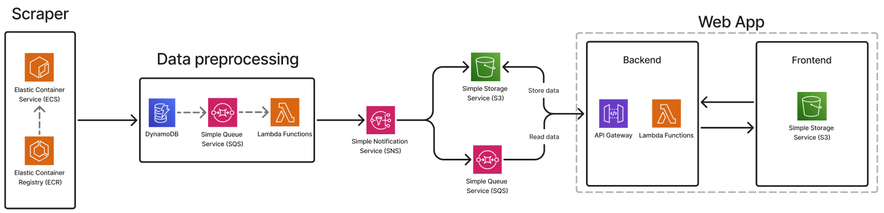

# AWS Data label web page

This project consists in a single page web app to label tokens to create datasets usable to train or finetune ai models.

It is cloud native and interely based on AWS.

## Architecture



The app contains a scraper used as a data source. Its Docker image is stored in an ECR registry and the containers run thanks to ECS. The Container Service uses a cluster of EC2 instances to run the container.

The scraper uses a DynamoDB table to remove duplicates (based on the id of each job post) and writes them in an SQS queue from where they will be read by a Lambda function that handles the preprocessing of data. In particular the description of the job will be tokenized.

Preprocessed data are published in an SNS topic that, using the Fanout pattern, sends them to another SQS queue and save them in an S3 bucket (through a Lambda function).

The web app will read the job posts from the queue and will show them to allow the user to label single tokens. The labeled data are then saved in S3.

The web page is hosted in an S3 bucket (different from the one where the data are stored) and the backend is handled by an API Gateway and Lambda functions.

## Prerequisites

The following are the prerequisites to run this project:

- **Python 3.11+** - [Download Python](https://www.python.org/downloads/)
- **Node.js and npm** - Required for AWS CDK - [Download Node.js](https://nodejs.org/)
- **AWS CLI** - [Installation Guide](https://docs.aws.amazon.com/cli/latest/userguide/getting-started-install.html)
- **AWS CDK** - Install globally with npm:
  ```bash
  npm install -g aws-cdk
  ```
- **AWS Account** - An active AWS account is needed

## Setup Instructions

### 1. Clone the Repository

```bash
git clone <repository-url>
cd <project-directory>
```

### 2. Set Up Python Virtual Environment

Create and activate a virtual environment:

**On macOS/Linux:**
```bash
python3 -m venv .venv
source .venv/bin/activate
```

**On Windows:**
```bash
python -m venv .venv
.venv\Scripts\activate
```

### 3. Install Python Dependencies

```bash
pip install -r requirements.txt
```

### 4. Configure AWS Credentials

Configure your AWS credentials using the AWS CLI:

```bash
aws configure
```

You'll need to provide:
- AWS Access Key ID
- AWS Secret Access Key
- Default region name
- Default output format

### 5. Bootstrap Your AWS Account (First Time Only)

If this is the first time using CDK in the configured AWS account and region, you need to bootstrap it:

```bash
cdk bootstrap
```

This creates the necessary AWS resources (S3 bucket, IAM roles, etc.) that CDK needs to deploy the infrastructure.

**Note:** You only need to run this command once per AWS account/region combination.

### 6. Deploy the Infrastructure

This project uses a Github Actions workflow to handle the deployment of the infrastructure. It runs all the commands needed to deploy the app using the AWS CDK.
The workflow is triggered each time a push in the main branch is done.
To correctly use it, you need to configure your AWS credentials as secrets in Github.

If you prefer to deploy the infrastructure manually, follow these steps:

Synthesize the CloudFormation template:

```bash
cdk synth
```

Deploy the stack to your AWS account:

```bash
cdk deploy
```

You'll be asked to confirm the deployment and any IAM changes. Type `y` to proceed.

## Useful CDK Commands

- `cdk ls` - List all stacks in the app
- `cdk synth` - Synthesize CloudFormation template
- `cdk deploy` - Deploy stack to your AWS account
- `cdk diff` - Compare deployed stack with current state
- `cdk destroy` - Remove all resources from your AWS account

## Cleanup

To avoid ongoing AWS charges, destroy the stack when you're done:

```bash
cdk destroy
```

**Warning:** This will delete all resources created by the stack. Make sure to backup any important data first.

## Troubleshooting

### Common Issues

**Issue: CDK command not found**
- Solution: Make sure AWS CDK is installed globally: `npm install -g aws-cdk`

**Issue: Permission denied errors during deployment**
- Solution: Verify your AWS credentials have sufficient permissions to create the required resources

**Issue: Bootstrap stack already exists**
- Solution: This is normal if you've used CDK before in this account/region. Skip the bootstrap step.